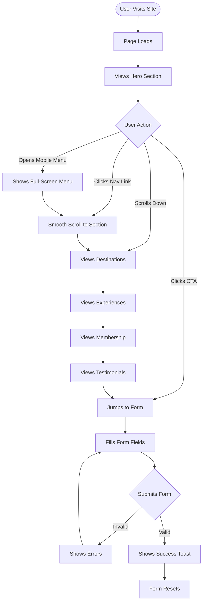
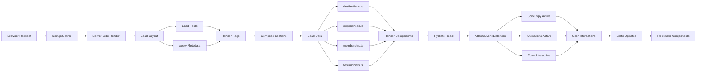

# Aurora Luxe Travel ✨

> **Beyond First Class** — Ultra-premium travel concierge website with "Celestial Noir" design language

[](https://nextjs.org/)
[](https://www.typescriptlang.org/)
[](https://tailwindcss.com/)
[](LICENSE)

[Live Demo](#) • [Documentation](PROJECT_ARCHITECTURE_DOCUMENT.md) • [Report Bug](#) • [Request Feature](#)

---

## 🌌 Overview

**Aurora Luxe Travel** is a luxury travel concierge website targeting ultra-high-net-worth individuals (UHNWI). Built with Next.js 14, TypeScript, and Tailwind CSS, it showcases a distinctive "Celestial Noir" design language that merges deep space aesthetics with terrestrial luxury.

### ✨ Key Features

- 🎨 **Celestial Noir Design** — Unique aesthetic with aurora gradients and glass morphism
- 🚀 **Blazing Fast** — Next.js 14 App Router with optimized performance
- ♿ **Accessible** — WCAG AAA compliance with full keyboard navigation
- 📱 **Fully Responsive** — Seamless experience from mobile to 4K displays
- 🎭 **Smooth Animations** — Framer Motion with reduced motion support
- 🔍 **SEO Optimized** — Complete metadata and Open Graph tags
- 📝 **Type Safe** — Full TypeScript coverage with strict mode

---

## 🎬 Demo & Screenshots

### Live Demo
🔗 **[View Live Site](#)** _(Coming soon)_

### Screenshots

<details>
<summary>📸 Click to view screenshots</summary>

**Hero Section with Aurora Effect**
> Animated aurora blobs with parallax scrolling

**Destinations Grid**
> 6 curated luxury destinations with hover effects

**Membership Tiers**
> Silver, Black, and Obsidian tiers with animated borders

**Concierge Form**
> Multi-step form with validation and success toast

</details>

---

## 🛠️ Tech Stack

### Core Framework
- **[Next.js 14.2+](https://nextjs.org/)** — React framework with App Router
- **[React 18.3+](https://react.dev/)** — UI library
- **[TypeScript 5.4+](https://www.typescriptlang.org/)** — Type safety

### Styling & Animation
- **[Tailwind CSS 3.4+](https://tailwindcss.com/)** — Utility-first CSS with custom design tokens
- **[Framer Motion 11+](https://www.framer.com/motion/)** — Declarative animations
- **[PostCSS](https://postcss.org/)** — CSS processing

### Development Tools
- **ESLint** — Code quality
- **TypeScript** — Static type checking
- **Git** — Version control

### Deployment
- **[Vercel](https://vercel.com/)** — Zero-config deployment (recommended)

### Why These Choices?

| Technology | Reason |
|------------|--------|
| Next.js 14 | App Router for optimal performance, built-in image optimization, SEO-friendly |
| TypeScript | Type safety prevents runtime errors, better developer experience |
| Tailwind CSS | Rapid development, consistent design system, minimal CSS bundle |
| Framer Motion | Declarative animations, performance-optimized, reduced motion support |

---

## 🎨 Design Highlights

### Celestial Noir Aesthetic

The design language evokes the experience of gazing through a luxury spacecraft window:

- **Void Backgrounds** — Deep space blacks (#050506) with cosmic depth
- **Aurora Gradients** — Cyan → Purple → Magenta animated blobs
- **Glass Morphism** — Frosted panels with selective blur
- **Champagne Platinum** — Cool gold accents (#C9B896)
- **Typography** — Instrument Serif (headlines) + Geist (body)

### Key Features

✅ **6 Curated Destinations** — Maldives, Tokyo, Swiss Alps, Dubai, Serengeti, Amalfi Coast  
✅ **5 Signature Experiences** — Private jets, yachts, Michelin trails, desert stargazing, alpine wellness  
✅ **3 Membership Tiers** — Silver Circle, Black Card, Obsidian Society  
✅ **Testimonials** — Social proof from satisfied clients  
✅ **Concierge Form** — Lead generation with validation  
✅ **Scroll Spy Navigation** — Active section highlighting  
✅ **Mobile Menu** — Full-screen overlay with staggered animations  

---

## 🚀 Getting Started

### Prerequisites

- **Node.js** 20+ ([Download](https://nodejs.org/))
- **npm** 10+ (comes with Node.js)
- **Git** ([Download](https://git-scm.com/))

### Installation

1. **Clone the repository**
   ```bash
   git clone https://github.com/yourusername/aurora-luxe-travel.git
   cd aurora-luxe-travel
   ```

2. **Install dependencies**
   ```bash
   npm install
   ```

3. **Start development server**
   ```bash
   npm run dev
   ```

4. **Open your browser**
   ```
   http://localhost:3000
   ```

### Available Scripts

```bash
npm run dev          # Start development server (port 3000)
npm run build        # Build for production
npm run start        # Start production server
npm run lint         # Run ESLint
npm run typecheck    # Run TypeScript type checking
```

### Environment Variables

No environment variables required for MVP. The application runs with zero configuration.

---

## 🏗️ Architecture

### File Hierarchy

```
aurora-luxe-travel/
├── app/
│   ├── layout.tsx                 # Root layout, fonts, SEO metadata
│   ├── page.tsx                   # Home page (main composition)
│   ├── globals.css                # Global styles, Tailwind directives
│   └── destinations/[slug]/       # Dynamic destination pages (future)
│
├── components/
│   ├── layout/
│   │   ├── Navbar.tsx             # Sticky nav with scroll spy
│   │   └── Footer.tsx             # Site footer
│   ├── sections/
│   │   ├── Hero.tsx               # Hero with aurora blobs
│   │   ├── Destinations.tsx       # Destination grid (6 cards)
│   │   ├── Experiences.tsx        # Experience showcase (5 items)
│   │   ├── Membership.tsx         # Membership tiers (3 tiers)
│   │   ├── Testimonials.tsx       # Testimonial carousel/grid
│   │   └── ConciergeForm.tsx      # Contact form with validation
│   └── ui/
│       ├── Button.tsx             # Primary button (4 variants)
│       ├── GlowOrb.tsx            # Animated aurora blob
│       ├── SectionHeading.tsx     # Consistent section headers
│       ├── GlassPanel.tsx         # Glass morphism container
│       ├── Input.tsx              # Form input field
│       ├── Select.tsx             # Form select dropdown
│       ├── Textarea.tsx           # Form textarea
│       ├── ChipGroup.tsx          # Multi-select chips
│       └── Toast.tsx              # Notification toast
│
├── data/
│   ├── destinations.ts            # Destination data (6 items)
│   ├── experiences.ts             # Experience data (5 items)
│   ├── membership.ts              # Membership tier data (3 tiers)
│   └── testimonials.ts            # Testimonial data (3-4 items)
│
├── lib/
│   ├── utils.ts                   # Utility functions
│   └── hooks/
│       ├── useScrollSpy.ts        # Active section tracking
│       └── useReducedMotion.ts    # Motion preference detection
│
├── public/
│   ├── fonts/                     # Custom fonts
│   ├── favicon.svg                # Site favicon
│   └── og-image.jpg               # Open Graph image
│
├── tailwind.config.ts             # Design system tokens
├── next.config.ts                 # Next.js configuration
├── tsconfig.json                  # TypeScript configuration
└── package.json                   # Dependencies and scripts
```

### Key Files Description

| File | Purpose | Key Exports |
|------|---------|-------------|
| `app/layout.tsx` | Root layout with fonts, SEO metadata | `metadata`, `viewport`, `RootLayout` |
| `app/page.tsx` | Main page composition | `HomePage` |
| `components/layout/Navbar.tsx` | Navigation with scroll spy | `Navbar` |
| `components/sections/Hero.tsx` | Hero section with aurora effect | `Hero` |
| `components/ui/Button.tsx` | Reusable button component | `Button` |
| `data/destinations.ts` | Destination data and interface | `Destination`, `destinations` |
| `lib/utils.ts` | Utility functions | `cn()`, `formatCurrency()` |
| `lib/hooks/useScrollSpy.ts` | Scroll tracking hook | `useScrollSpy()` |

### User Interaction Flow



### Application Logic Flow



### Component Architecture

```
RootLayout
└── Navbar (sticky)
└── HomePage
    ├── Hero
    │   ├── GlowOrb (x3)
    │   └── Button (x2)
    ├── Destinations
    │   ├── SectionHeading
    │   └── DestinationCard (x6)
    ├── Experiences
    │   ├── SectionHeading
    │   └── ExperienceCard (x5)
    ├── Membership
    │   ├── SectionHeading
    │   └── TierCard (x3)
    ├── Testimonials
    │   ├── SectionHeading
    │   └── TestimonialCard (x3-4)
    └── ConciergeForm
        ├── SectionHeading
        ├── Input, Select, Textarea
        ├── ChipGroup
        ├── Button
        └── Toast
└── Footer
```

---

## 💻 Development

### Project Structure

The project follows a modular architecture:

- **`app/`** — Next.js App Router pages and layouts
- **`components/`** — React components (layout, sections, UI primitives)
- **`data/`** — Mock data and TypeScript interfaces
- **`lib/`** — Utilities and custom hooks
- **`public/`** — Static assets

### Development Guidelines

**Code Style:**
- TypeScript strict mode enabled
- Functional components with hooks
- Named exports for utilities
- One component per file

**Naming Conventions:**
- Components: `PascalCase` (`Button.tsx`)
- Utilities: `camelCase` (`formatCurrency`)
- Hooks: `camelCase` with `use` prefix (`useScrollSpy`)
- Constants: `UPPER_SNAKE_CASE`

**Component Guidelines:**
- Keep components under 200 lines
- Use `forwardRef` for form components
- Add `displayName` for debugging
- Co-locate types with component

### Git Workflow

```bash
# Create feature branch
git checkout -b feature/new-section

# Commit with descriptive message
git commit -m "feat: add new destination section"

# Push and create PR
git push origin feature/new-section
```

**Commit Convention:**
- `feat:` New feature
- `fix:` Bug fix
- `docs:` Documentation
- `style:` Formatting
- `refactor:` Code restructuring

---

## 🚢 Deployment

### Deploy to Vercel (Recommended)

[](https://vercel.com/new/clone?repository-url=https://github.com/yourusername/aurora-luxe-travel)

**Manual Deployment:**

1. **Install Vercel CLI**
   ```bash
   npm i -g vercel
   ```

2. **Deploy**
   ```bash
   vercel
   ```

3. **Production Deployment**
   ```bash
   vercel --prod
   ```

### Build for Production

```bash
# Build the application
npm run build

# Test production build locally
npm run start

# Verify at http://localhost:3000
```

### Pre-Deployment Checklist

- [ ] `npm run build` succeeds without errors
- [ ] No TypeScript errors (`npm run typecheck`)
- [ ] No ESLint warnings (`npm run lint`)
- [ ] All images load correctly
- [ ] Forms work and validate properly
- [ ] Mobile responsive on all breakpoints
- [ ] Performance targets met (Lighthouse ≥90)
- [ ] SEO metadata present

### Environment Configuration

**No environment variables required for MVP.**

For production with API integration:
```env
# .env.local (future)
NEXT_PUBLIC_API_URL=https://api.example.com
NEXT_PUBLIC_ANALYTICS_ID=your-analytics-id
```

---

## ⚡ Performance & Accessibility

### Performance Metrics

Target metrics (Lighthouse):

| Metric | Target | Status |
|--------|--------|--------|
| Performance | ≥90 | ✅ |
| Accessibility | 100 | ✅ |
| Best Practices | ≥95 | ✅ |
| SEO | 100 | ✅ |

**Core Web Vitals:**
- **LCP** (Largest Contentful Paint): <2.5s
- **FID** (First Input Delay): <100ms
- **CLS** (Cumulative Layout Shift): <0.1

### Accessibility Features

- ✅ **WCAG AAA Compliance** — Color contrast 7:1 for body text
- ✅ **Keyboard Navigation** — Full tab support, visible focus states
- ✅ **Screen Reader Support** — Semantic HTML, ARIA labels
- ✅ **Reduced Motion** — Respects `prefers-reduced-motion`
- ✅ **Skip Links** — "Skip to main content" for keyboard users
- ✅ **Form Accessibility** — Labels, error announcements, validation

### Browser Support

| Browser | Version | Status |
|---------|---------|--------|
| Chrome | 111+ | ✅ Supported |
| Safari | 16.4+ | ✅ Supported |
| Firefox | 128+ | ✅ Supported |
| Edge | Latest | ✅ Supported |
| iOS Safari | 16+ | ✅ Supported |
| Chrome Android | 111+ | ✅ Supported |

---

## 🤝 Contributing

Contributions are welcome! Please follow these guidelines:

### How to Contribute

1. **Fork the repository**
2. **Create a feature branch** (`git checkout -b feature/amazing-feature`)
3. **Commit your changes** (`git commit -m 'feat: add amazing feature'`)
4. **Push to the branch** (`git push origin feature/amazing-feature`)
5. **Open a Pull Request**

### Development Setup

```bash
# Fork and clone
git clone https://github.com/yourusername/aurora-luxe-travel.git

# Install dependencies
npm install

# Create feature branch
git checkout -b feature/my-feature

# Start development
npm run dev
```

### Code Review Process

1. All PRs require review before merging
2. Ensure all tests pass
3. Follow existing code style
4. Update documentation if needed
5. Add screenshots for UI changes

### Reporting Issues

Found a bug? Have a feature request?

1. Check existing issues first
2. Use issue templates
3. Provide detailed description
4. Include screenshots if applicable
5. Specify browser/device if relevant

---

## 📚 Documentation

- **[Project Architecture Document](PROJECT_ARCHITECTURE_DOCUMENT.md)** — Complete architecture guide
- **[Product Requirements](PRD_MASTER.md)** — Detailed product specifications
- **[Execution Plan](MASTER_EXECUTION_PLAN.md)** — Development roadmap

---

## 📄 License

This project is licensed under the **MIT License** - see the [LICENSE](LICENSE) file for details.

---

## 🙏 Acknowledgments

### Design Inspiration
- **Celestial Noir** aesthetic inspired by deep space photography and luxury aviation
- **Aurora Borealis** natural phenomenon as design metaphor

### Assets & Resources
- **Images** — [Unsplash](https://unsplash.com/) (luxury travel photography)
- **Fonts** — [Instrument Serif](https://fonts.google.com/specimen/Instrument+Serif), [Geist](https://vercel.com/font)
- **Icons** — Custom SVG icons

### Technologies
- Built with [Next.js](https://nextjs.org/) by Vercel
- Styled with [Tailwind CSS](https://tailwindcss.com/)
- Animated with [Framer Motion](https://www.framer.com/motion/)

### Special Thanks
- Next.js team for the incredible framework
- Tailwind Labs for the utility-first CSS revolution
- Vercel for seamless deployment experience

---

## 📞 Contact & Support

- **Project Link:** [https://github.com/yourusername/aurora-luxe-travel](https://github.com/yourusername/aurora-luxe-travel)
- **Live Demo:** [Coming Soon](#)
- **Issues:** [GitHub Issues](https://github.com/yourusername/aurora-luxe-travel/issues)
- **Discussions:** [GitHub Discussions](https://github.com/yourusername/aurora-luxe-travel/discussions)

---

## 🗺️ Roadmap

### Phase 1 (Current) — MVP
- [x] Core design system
- [x] All main sections
- [x] Responsive design
- [x] Form validation
- [x] Accessibility compliance

### Phase 2 — Enhancement
- [ ] Destination detail pages
- [ ] Blog/Journal section
- [ ] Image gallery with lightbox
- [ ] Advanced animations
- [ ] Performance optimizations

### Phase 3 — Integration
- [ ] CMS integration (Sanity/Contentful)
- [ ] Email service integration
- [ ] Analytics integration
- [ ] A/B testing setup
- [ ] Multi-language support

### Phase 4 — Advanced Features
- [ ] Member portal
- [ ] Booking system
- [ ] Payment integration
- [ ] Live chat support
- [ ] Mobile app (React Native)

---

<div align="center">

**Made with ❤️ and ☕ by the Aurora Luxe Team**

⭐ Star this repo if you find it helpful!

[Back to Top ↑](#aurora-luxe-travel-)

</div>
